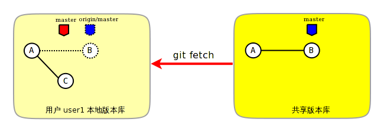
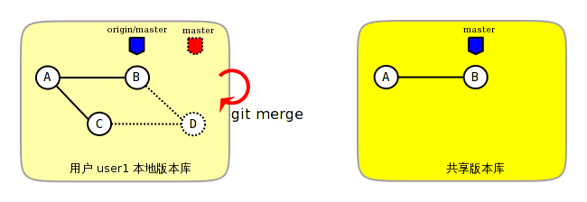

## git pull中的合并

我们已知是由两个步骤组成的，一个是获取（FETCH）操作，一个是合并（MERGE）操作

```
git pull =  git fetch + git merge
```

用户user1执行PULL操作的第一阶段，将共享版本库master分支的最新提交拉回到本地，并更新到本地版本库特定的引用refs/remotes/origin/master（简称为origin/master）



用户user1执行PULL操作的第二阶段，将本地分支master和共享版本库本地跟踪分支origin/master进行合并操作



合并操作的大多数情况，只须提供一个<commit>（提交ID或对应的引用：分支、里程碑等）作为参数。合并操作将<commit>对应的目录树和当前工作分支的目录树的内容进行合并，合并后的提交以当前分支的提交作为第一个父提交，以<commit>为第二个父提交。

默认情况下，合并后的结果会自动提交，但是如果提供--no-commit选项，则合并后的结果会放入暂存区，用户可以对合并结果进行检查、更改，然后手动提交。

合并操作并非总会成功，因为合并的不同提交可能同时修改了同一文件相同区域的内容，导致冲突。冲突会造成合并操作的中断，冲突的文件被标识，用户可以对标识为冲突的文件进行冲突解决操作，然后更新暂存区，再提交，最终完成合并操作。

## 手动解决冲突
如果两个用户修改了同一文件的同一区域，则在合并的时候会遇到冲突导致合并过程中断。这是因为Git并不能越俎代庖的替用户做出决定，而是把决定权交给用户。在这种情况下，Git显示为合并冲突，等待用户对冲突做出抉择。

执行`git status` ，可以从状态输出中看到文件处于未合并的状态
```
$ git status
# On branch master
# Your branch and 'refs/remotes/origin/master' have diverged,
# and have 1 and 1 different commit(s) each, respectively.
#
# Unmerged paths:
#   (use "git add/rm <file>..." as appropriate to mark resolution)
#
#       both modified:      doc/README.txt
#
no changes added to commit (use "git add" and/or "git commit -a")
```

**那么Git是如何记录合并过程及冲突的呢？**

实际上合并过程是通过.git目录下的几个文件进行记录的：

-   文件.git/MERGE_HEAD记录所合并的提交ID。
-   文件.git/MERGE_MSG记录合并失败的信息。
-   文件.git/MERGE_MODE标识合并状态。

工作区的版本可能同时包含了成功的合并及冲突的合并，其中冲突的合并会用特殊的标记（<<<<<<< ======= >>>>>>>）进行标识。查看当前工作区中冲突的文件：
```
$ cat doc/README.txt
User1 hacked.
<<<<<<< HEAD
Hello, user2.
=======
Hello, user1.
>>>>>>> a123390b8936882bd53033a582ab540850b6b5fb
User2 hacked.
User2 hacked again.
```
特殊标识<<<<<<<（七个小于号）和七个等号之间的内容是当前分支所更改的内容。在特殊标识（七个等号）和>>>>>>>（七个大于号）之间的内容是所合并的版本更改的内容。

通过编辑操作，将冲突标识符所标识的冲突内容替换为合适的内容，并去掉冲突标识符。编辑完毕后执行**git add**命令将文件添加到暂存区（标号0），然后再提交就完成了冲突解决。

## 用merge策略来完成冲突解决
Git合并操作支持很多合并策略，默认会选择最适合的合并策略。
例如，和一个分支进行合并时会选择recursive合并策略。
当和两个或两个以上的其他分支进行合并时采用octopus合并策略。
```
git merge [-s <strategy>] [-X <strategy-option>] <commit>...
```
其中参数-s用于设定合并策略，参数-X用于为所选的合并策略提供附加的参数

合并策略: 
* ort
    替代原来的递归recursive。该合并策略只能用于合并两个头（即当前分支和另外的一个分支），使用三向合并策略。这个合并策略是合并两个头指针时的默认合并策略
    * ours: 这个选项的冲突需要通过优先选择“我们的”版本来完全自动解决
    * theirs:与“ours”策略相反
* resolve
    这只能使用三向合并算法解决两个标题。它试图仔细检测纵横交错的合并歧义。他不处理重命名
* octopus
	两个以上标题的默认合并策略。当多个分支传递时，octopus 会自动启动。如果合并有需要手动解决的冲突，octopus 将拒绝合并尝试。它主要用于将相似的功能分支标题捆绑在一起
* ours
	我们的策略在 N 个分支上运行。输出合并结果始终是当前分支 `HEAD` 的合并结果。“我们的策略”术语意味着偏好实际上忽略了所有其他分支的所有变更。它旨在用于合并相似功能分支的历史记录。
* subtree
	这是递归策略的扩展。合并 A 和 B 时，如果 B 是 A 的子子树，则首先更新 B 以反映 A 的树结构，还会对 A 和 B 之间共享的公共祖先树进行此更新


### ort策略示例
我们线上远程的仓库是commitA->commitB；

本地仓库是commitA->commitC

commitB 跟commitC是对同一行进行修改，必然冲突
```
$ git fetch

$ git merge origin/main
Auto-merging doc/first.txt
CONFLICT (content): Merge conflict in doc/first.txt
Automatic merge failed; fix conflicts and then commit the result.
```
假设，我们选择ours选项
```
git merge origin/main -Xours
```
产生了一个新的提交，commitA->commitB->commitC->mergeCommit。最后冲突的内容选择保留本地的内容。

theirs 与ours 相反，选择的是远端的内容。


